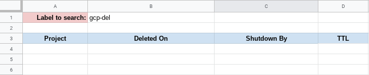

# GCP Project Deletion Tracker

Projects deleted in Google Cloud Platform (GCP) are given a grace period of 30 days before they're actually deleted. However, besides the email sent notifying when the project will be deleted there is no central location to manage that, especially when you're working with lots projects that are created and deleted.

This Google Script helps by parsing the email notification sent to the admin account and puts the information extracted in Google Sheets.

## Prerequisites

* GCP Account
* Gmail label and filter
* Google Sheet and Script

### GCP Account

You need to have a GCP account and access to the admin/root account.

### Gmail Setup

Create a Gmail filter to apply a label to messages sent about projects being deleted.

```
Settings > Filters and Blocked Addressses > Create a new filter
```

Add the following information:

```
From: PlatformNotfications-noreply@google.com
Has the words: deletion

---

Hit CONTINUE

---

Check the following boxes:

  * Skip the Inbox
  * Mark as read
  * Apply the label:
    * create a new label (in this example I'm using "gcp-del")

---

Save the filter
```

### Google Sheet Setup

Create a new Google Sheet and format it as such:

* Cell B1: put the name of the label you've just created
* Cell A3: Project
* Cell B3: Deleted On
* Cell C3: Shutdown By
* Cell D3: TTL

*Note*: you can copy this [template](https://docs.google.com/spreadsheets/u/1/d/1743VMziJoqlES2ylG88L8prlwC6VS8Dy6wmzt5SJl3g/copy)

See the example below:



Then go to **Tools > Script Editor** and paste the code from [Code.gs](Code.gs).

Save it and refresh the SpreadSheet. You should have a new button show up to the right of the **Help** button called **GCP**.

## Running the code

On your first run, you'll be prompt for permissions to run the script.

### Populating the SpreadSheet

Open up this spreadsheet and click on

* **GCP > Extract data from email**

This operation will perform the following tasks:

1. Search for messages in Gmail with the label you've set
2. Populate the rows in the spreadsheet
3. Delete the message notifications

### TTL

If you want to know how many days are left until the project is actually deleted, go to: 

* **GCP > Calculate TTL**

This will paste a formula in column **D** which will calculate the days left.

### Clean up

If you want to remove expired projects from the sheet, click on:

* **GCP > Remove expired data**

## License

This project is licensed under the Apache-2.0 License - see the [LICENSE](LICENSE) file for details